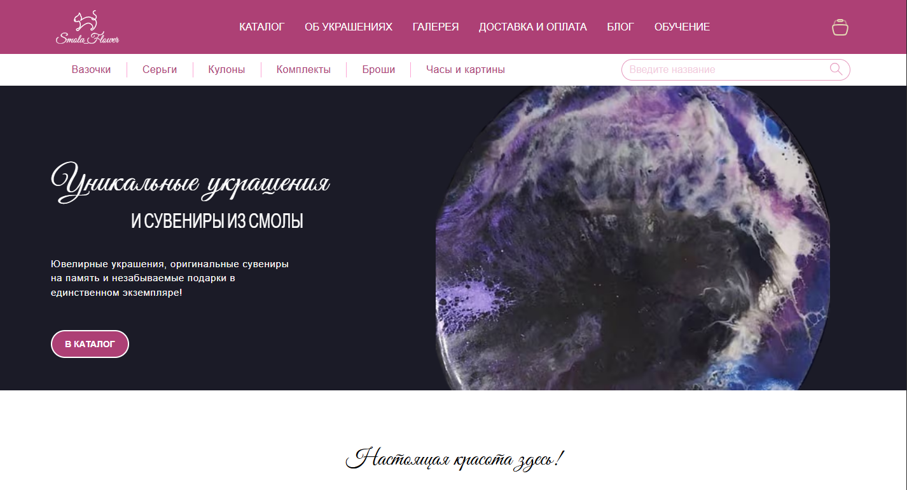
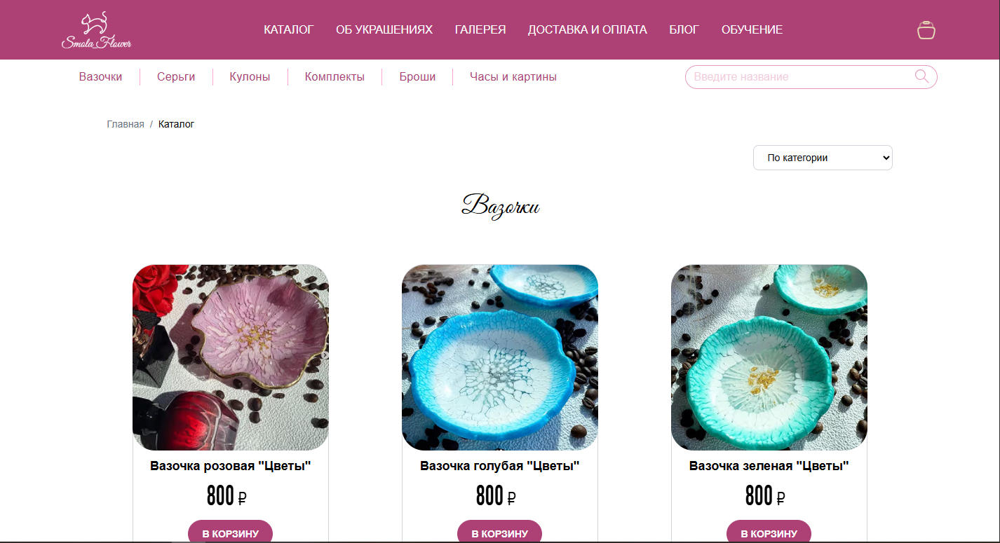
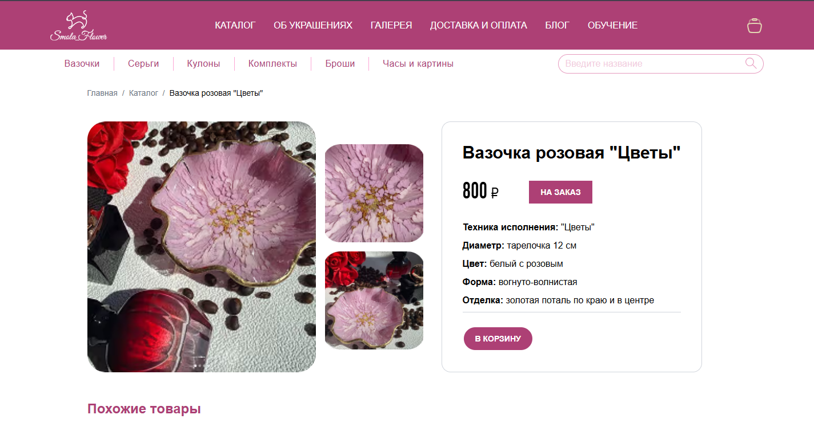
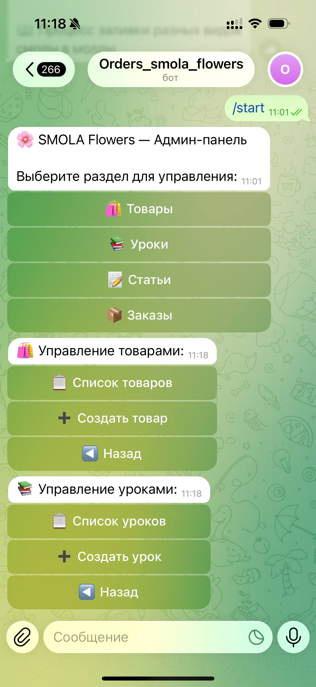

# Smola Flowers


Smola Flowers — полнофункциональный Full Stack интернет-магазин украшений и сувениров из эпоксидной смолы с административной панелью на базе Telegram-бота, разработанный с использованием Next.js, NestJS и Supabase.

## Preview


*Главная страница*


*Каталог*


*Страница товара*

<p align="center">
  
</p>
*Telegram Admin Panel*

## Demo

Frontend: https://smola-flower.vercel.app  
Backend API: https://smola-flower.onrender.com

## Основные функции

- каталог товаров
- полнотекстовый поиск
- фильтрация
- управление корзиной
- оформление заказа
- система отзывов
- похожие товары
- блог
- уроки
- Telegram CRM

## Технологии

| Слой | Стек |
|---|---|
| Frontend | Next.js, React, TypeScript, Tailwind CSS |
| Backend | NestJS, Supabase, Telegram Bot (nestjs-telegraf) |
| State | Zustand |
| API | Axios, React Query |
| Validation | class-validator, class-transformer |
| Testing | Jest, React Testing Library |
| Dev tooling | ESLint, Prettier, TypeScript |

## Архитектура

```text
frontend/
├── app/
├── widgets/
├── features/
├── entities/
└── shared/

backend/
├── modules/
├── integrations/
├── database/
└── common/
```

## API

- GET `/api/products`
- GET `/api/products/:id`
- GET `/api/lessons`
- GET `/api/notes`
- POST `/api/orders`
- POST `/api/comments`

## Запуск локально

### Backend

1. Перейдите в папку `backend`:

```bash
cd backend
```

2. Установите зависимости:

```bash
npm install
```

3. Создайте `.env` файл с переменными:

```env
PORT=3001
SUPABASE_URL=YOUR_SUPABASE_URL
SUPABASE_KEY=YOUR_SUPABASE_KEY
TELEGRAM_BOT_TOKEN=YOUR_TELEGRAM_BOT_TOKEN
TELEGRAM_CHAT_ID=YOUR_ADMIN_CHAT_ID
CORS_ORIGIN=http://localhost:3000
...
```

4. Запустите сервер:

```bash
npm run dev
```

### Frontend

1. Перейдите в папку `frontend`:

```bash
cd frontend
```

2. Установите зависимости:

```bash
npm install
```

3. Создайте `.env` файл с переменными:

```env
NEXT_PUBLIC_BACKEND_API_URL=http://localhost:3001
BACKEND_API_URL=http://localhost:3001
...
```

4. Запустите приложение:

```bash
npm run dev
```

После запуска frontend будет доступен на `http://localhost:3000`, backend — на `http://localhost:3001`.

## Тестирование

### Backend

```bash
cd backend
npm run test
```

### Frontend

```bash
cd frontend
npm run test
```

## Архитектурные решения

- Feature-based архитектура frontend
- Server Components и Client Components в Next.js
- централизованный HTTP-клиент на Axios
- React Query для кеширования и синхронизации данных
- Zustand для глобального состояния корзины
- модульная архитектура NestJS
- DTO и ValidationPipe
- интеграция с Supabase Storage

## Схема взаимодействия

```text
Browser
    │
    ▼
Next.js Frontend
    │
 REST API
    │
    ▼
NestJS Backend
    ├── Supabase Database
    ├── Supabase Storage
    └── Telegram Admin Bot
```

## Дальнейшие планы

- добавить CI/CD для автоматической сборки и тестирования
- расширить сценарии e2e-тестирования для пользовательских потоков
- внедрить централизованную авторизацию и роли
- добавить мониторинг ошибок и логирование на backend


**Smola Flowers** — полнофункциональный full-stack проект интернет-магазина с современным подходом к разработке. Проект включает клиентскую часть на Next.js, серверную часть на NestJS, интеграцию с Supabase и Telegram-ботом, модульную архитектуру, строгую типизацию TypeScript и поддержку тестирования.
